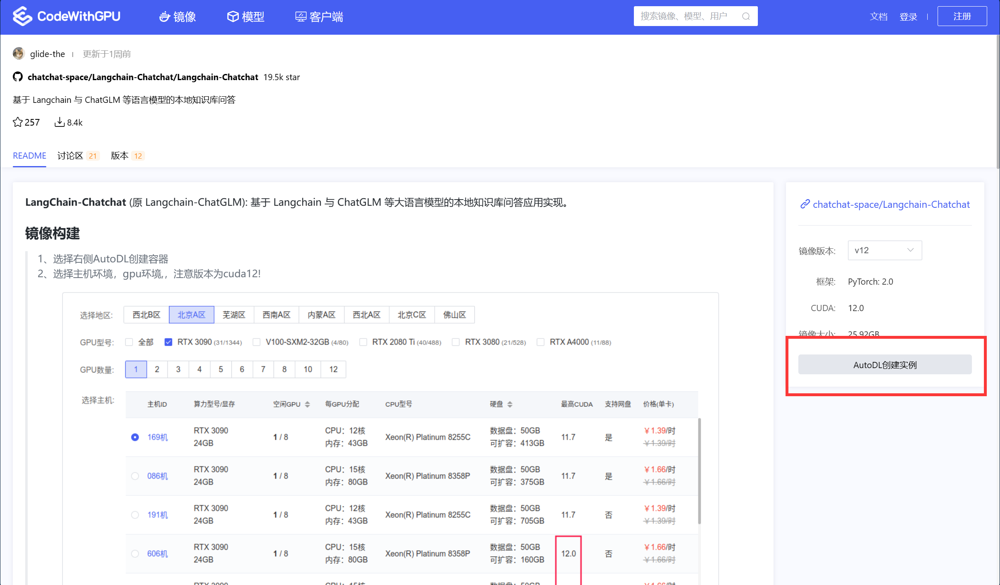
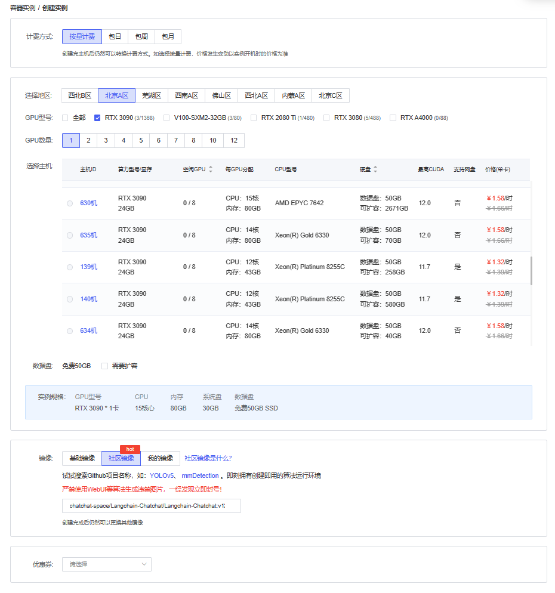
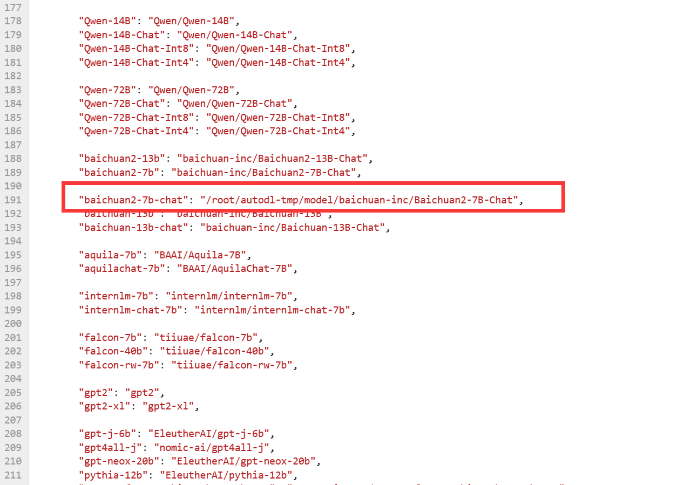
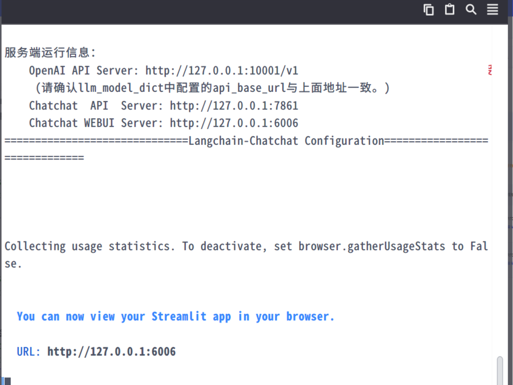
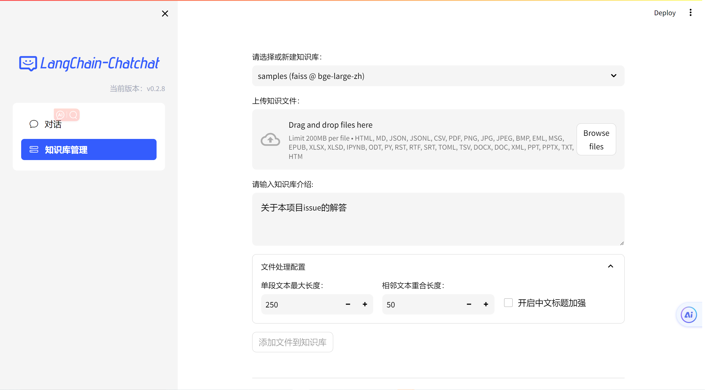

# Baichuan2-7B-chat langchain 接入

这篇主要讲 `Baichuan2-7B-chat` 如何对接`Langchain`中 `langchain.llms.base` 的 `LLM` 模块，并且提供一个快捷搭建向量数据库、Agent等多功能的Langchain应用的部署方案；关于如何具体对接向量数据库和`gradio`的部分请参考[internLM langchain](https://github.com/datawhalechina/self-llm/blob/master/InternLM/06-InternLM%E6%8E%A5%E5%85%A5LangChain%E6%90%AD%E5%BB%BA%E7%9F%A5%E8%AF%86%E5%BA%93%E5%8A%A9%E6%89%8B.md)模块。

## 环境准备

在autodl平台中租一个3090等24G显存的显卡机器，如下图所示镜像选择PyTorch-->2.0.0-->3.8(ubuntu20.04)-->11.8（11.3版本以上的都可以） 接下来打开刚刚租用服务器的JupyterLab， 图像 并且打开其中的终端开始环境配置、模型下载和运行演示。


## 安装依赖

```Python
# 升级pip
python -m pip install --upgrade pip
# 更换 pypi 源加速库的安装
pip config set global.index-url https://pypi.tuna.tsinghua.edu.cn/simple

pip install modelscope==1.9.5
pip install transformers==4.35.2
pip install streamlit==1.24.0
pip install sentencepiece==0.1.99
pip install accelerate==0.24.1

pip install langchain==0.0.292
```

## 模型下载:

使用 modelscope 中的snapshot_download函数下载模型，第一个参数为模型名称，参数cache_dir为模型的下载路径。

在 /root/autodl-tmp 路径下新建 download.py 文件并在其中输入以下内容，粘贴代码后记得保存文件，如下图所示。并运行 python /root/autodl-tmp/download.py 执行下载，模型大小为15 GB，下载模型大概需要10~20分钟

```Python
import torch
from modelscope import snapshot_download, AutoModel, AutoTokenizer
import os
model_dir = snapshot_download('baichuan-inc/Baichuan2-7B-Chat',cache_dir='/root/autodl-tmp', revision='v1.0.4')
```

## Baichuan2-7B-chat 接入 LangChain

为便捷构建 LLM 应用，我们需要基于本地部署的 Baichuan2-7B-chat，自定义一个 LLM 类，将 Baichuan2-7B-chat 接入到 LangChain 框架中。完成自定义 LLM 类之后，可以以完全一致的方式调用 LangChain 的接口，而无需考虑底层模型调用的不一致。

基于本地部署的 Baichuan2-7B-chat 自定义 LLM 类并不复杂，我们只需从LangChain.llms.base.LLM 类继承一个子类，并重写构造函数与 `_call` 函数即可：

```Python
from langchain.llms.base import LLM
from typing import Any, List, Optional
from langchain.callbacks.manager import CallbackManagerForLLMRun
from transformers import AutoTokenizer, AutoModelForCausalLM, GenerationConfig
import torch

class baichuan2_LLM(LLM):
    # 基于本地 InternLM 自定义 LLM 类
    tokenizer : AutoTokenizer = None
    model: AutoModelForCausalLM = None

    def __init__(self, model_path :str):
        # model_path: InternLM 模型路径
        # 从本地初始化模型
        super().__init__()
        print("正在从本地加载模型...")
        self.tokenizer = AutoTokenizer.from_pretrained(model_path, trust_remote_code=True)
        self.model = AutoModelForCausalLM.from_pretrained(model_path, trust_remote_code=True,torch_dtype=torch.bfloat16,  device_map="auto")
        self.model.generation_config = GenerationConfig.from_pretrained(model_path)
        self.model = self.model.eval()
        print("完成本地模型的加载")

    def _call(self, prompt : str, stop: Optional[List[str]] = None,
                run_manager: Optional[CallbackManagerForLLMRun] = None,
                **kwargs: Any):
         # 重写调用函数
        messages = [
            {"role": "user", "content": prompt}
        ]
         # 重写调用函数
        response= self.model.chat(self.tokenizer, messages)
        return response
        
    @property
    def _llm_type(self) -> str:
        return "baichuan2_LLM"
```

## 调用

然后就可以像使用任何其他的langchain大模型功能一样使用了。

```Python
llm = baichuan2_LLM('/root/autodl-tmp/baichuan-inc/Baichuan2-7B-Chat')
llm('你是谁')
```


## 附加案例：使用Langchain-Chatchat快速搭建基于百川2的多功能问答平台

参考项目链接：[Langchain-Chatchat](https://github.com/chatchat-space/Langchain-Chatchat)

参考该项目AutoDL 镜像：[https://www.codewithgpu.com/i/chatchat-space/Langchain-Chatchat/Langchain-Chatchat](https://www.codewithgpu.com/i/chatchat-space/Langchain-Chatchat/Langchain-Chatchat)

### 具体部署流程：

进入该项目AutoDL 镜像：[https://www.codewithgpu.com/i/chatchat-space/Langchain-Chatchat/Langchain-Chatchat](https://www.codewithgpu.com/i/chatchat-space/Langchain-Chatchat/Langchain-Chatchat)

### 创建实例：



## 环境准备

在autodl平台中租一个3090等24G显存的显卡机器



## 默认的模型：


## 模型下载:

使用 modelscope 中的snapshot_download函数下载模型，第一个参数为模型名称，参数cache_dir为模型的下载路径。

在 /root/autodl-tmp 路径下新建 download.py 文件并在其中输入以下内容，粘贴代码后记得保存文件，如下图所示。并运行 python /root/autodl-tmp/download.py 执行下载，模型大小为15 GB，下载模型大概需要10~20分钟

```Python
import torch
from modelscope import snapshot_download, AutoModel, AutoTokenizer
import os
model_dir = snapshot_download('baichuan-inc/Baichuan2-7B-Chat',cache_dir='/root/autodl-tmp', revision='v1.0.4')
```

## 修改模型配置：

进入Langchain-Chatchat/configs/model_config.py文件，修改以下几个配置，调整成百川2模型

可选择多种模型：


添加本地模型地址：



## 调用：

选择新的终端

```Python
cd /root/Langchain-Chatchat/
conda activate /root/pyenv
python startup.py -a
```



可以考虑vsc的端口vsc端口转发功能，转发端口，本地运行

## 使用效果：

多模型选择对话：


知识库管理：



还有其他功能，可以自行尝试

