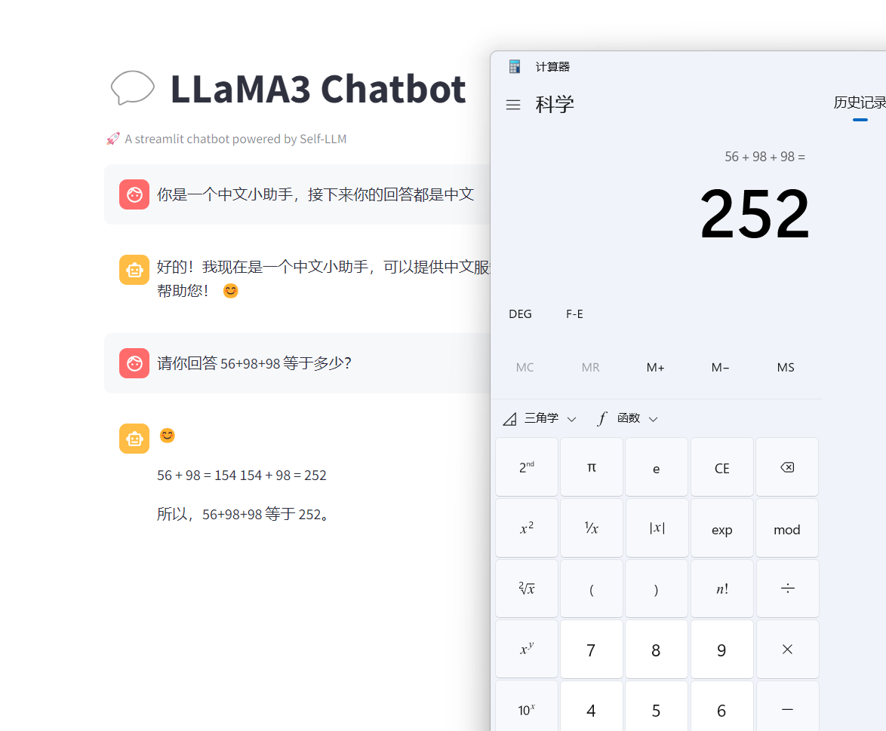

# LLaMA3-8B-Instruct WebDemo 部署

## 环境准备  

在 autodl 平台中租赁一个 3090 等 24G 显存的显卡机器，如下图所示镜像选择 `PyTorch-->2.1.0-->3.10(ubuntu20.04)-->12.1 `


接下来打开刚刚租用服务器的 JupyterLab，并且打开其中的终端开始环境配置、模型下载和运行 demo。

pip 换源加速下载并安装依赖包

```shell
# 升级pip
python -m pip install --upgrade pip
# 更换 pypi 源加速库的安装
pip config set global.index-url https://pypi.tuna.tsinghua.edu.cn/simple

pip install modelscope==1.11.0
pip install langchain==0.1.15
pip install "transformers>=4.40.0" accelerate tiktoken einops scipy transformers_stream_generator==0.1.16
pip install streamlit
```  

## 模型下载

使用 modelscope 中的 snapshot_download 函数下载模型，第一个参数为模型名称，参数 cache_dir 为模型的下载路径。

在 /root/autodl-tmp 路径下新建 model_download.py 文件并在其中输入以下内容，粘贴代码后记得保存文件，如下图所示。并运行 `python /root/autodl-tmp/model_download.py` 执行下载，模型大小为 14 GB，下载模型大概需要 2 分钟。

```python  
import torch
from modelscope import snapshot_download, AutoModel, AutoTokenizer
import os

model_dir = snapshot_download('LLM-Research/Meta-Llama-3-8B-Instruct', cache_dir='/root/autodl-tmp', revision='master')
```

## 代码准备

在`/root/autodl-tmp`路径下新建 `chatBot.py` 文件并在其中输入以下内容，粘贴代码后记得保存文件。下面的代码有很详细的注释，大家如有不理解的地方，欢迎提出issue。

```python
from transformers import AutoTokenizer, AutoModelForCausalLM
import torch
import streamlit as st

# 在侧边栏中创建一个标题和一个链接
with st.sidebar:
    st.markdown("## LLaMA3 LLM")
    "[开源大模型食用指南 self-llm](https://github.com/datawhalechina/self-llm.git)"

# 创建一个标题和一个副标题
st.title("💬 LLaMA3 Chatbot")
st.caption("🚀 A streamlit chatbot powered by Self-LLM")

# 定义模型路径
mode_name_or_path = '/root/autodl-tmp/LLM-Research/Meta-Llama-3-8B-Instruct'

# 定义一个函数，用于获取模型和tokenizer
@st.cache_resource
def get_model():
    # 从预训练的模型中获取tokenizer
    tokenizer = AutoTokenizer.from_pretrained(mode_name_or_path, trust_remote_code=True)
    tokenizer.pad_token = tokenizer.eos_token
    # 从预训练的模型中获取模型，并设置模型参数
    model = AutoModelForCausalLM.from_pretrained(mode_name_or_path, torch_dtype=torch.bfloat16).cuda()
  
    return tokenizer, model

def bulid_input(prompt, history=[]):
    system_format='<|begin_of_text|><<SYS>>\n{content}\n<</SYS>>\n\n'
    user_format='<|start_header_id|>user<|end_header_id|>\n\n{content}<|eot_id|>'
    assistant_format='<|start_header_id|>assistant<|end_header_id|>\n\n{content}<|eot_id|>\n'
    history.append({'role':'user','content':prompt})
    prompt_str = ''
    # 拼接历史对话
    for item in history:
        if item['role']=='user':
            prompt_str+=user_format.format(content=item['content'])
        else:
            prompt_str+=assistant_format.format(content=item['content'])
    return prompt_str

# 加载LLaMA3的model和tokenizer
tokenizer, model = get_model()

# 如果session_state中没有"messages"，则创建一个包含默认消息的列表
if "messages" not in st.session_state:
    st.session_state["messages"] = []

# 遍历session_state中的所有消息，并显示在聊天界面上
for msg in st.session_state.messages:
    st.chat_message(msg["role"]).write(msg["content"])

# 如果用户在聊天输入框中输入了内容，则执行以下操作
if prompt := st.chat_input():
    
    # 在聊天界面上显示用户的输入
    st.chat_message("user").write(prompt)
    
    # 构建输入
    input_str = bulid_input(prompt=prompt, history=st.session_state["messages"])
    input_ids = tokenizer.encode(input_str, add_special_tokens=False, return_tensors='pt').cuda()
    outputs = model.generate(
        input_ids=input_ids, max_new_tokens=512, do_sample=True,
        top_p=0.9, temperature=0.5, repetition_penalty=1.1, eos_token_id=tokenizer.encode('<|eot_id|>')[0]
        )
    outputs = outputs.tolist()[0][len(input_ids[0]):]
    response = tokenizer.decode(outputs)
    response = response.strip().replace('<|eot_id|>', "").replace('<|start_header_id|>assistant<|end_header_id|>\n\n', '').strip()

    # 将模型的输出添加到session_state中的messages列表中
    # st.session_state.messages.append({"role": "user", "content": prompt})
    st.session_state.messages.append({"role": "assistant", "content": response})
    # 在聊天界面上显示模型的输出
    st.chat_message("assistant").write(response)
    print(st.session_state)
```

## 运行 demo

在终端中运行以下命令，启动streamlit服务，并按照 `autodl` 的指示将端口映射到本地，然后在浏览器中打开链接 http://localhost:6006/ ，即可看到聊天界面。

```bash
streamlit run /root/autodl-tmp/chatBot.py --server.address 127.0.0.1 --server.port 6006
```

如下所示，可以看出LLaMA3自带思维链，应该是在训练的时候数据集里就直接有cot形式的数据集，LLaMA3很强！


