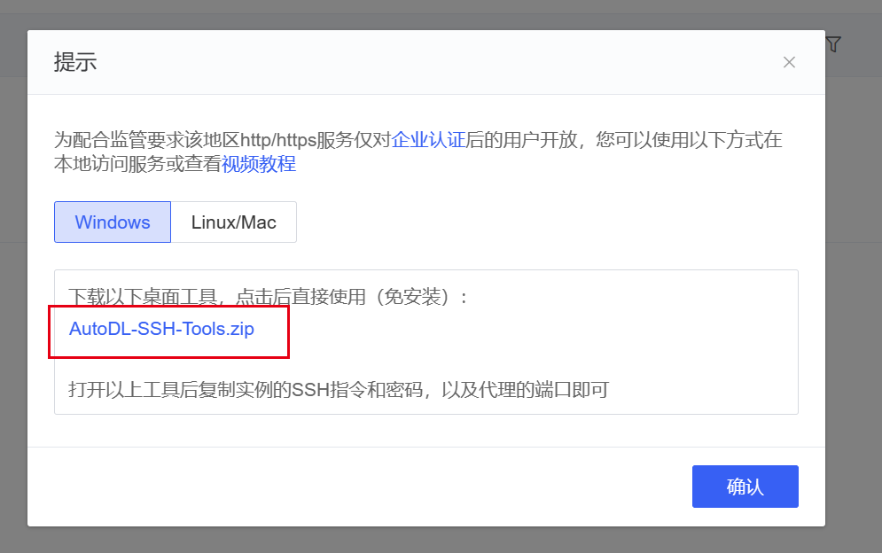

# MiniCPM-2B-chat WebDemo部署

## MiniCPM-2B-chat 介绍

MiniCPM 是面壁智能与清华大学自然语言处理实验室共同开源的系列端侧大模型，主体语言模型 MiniCPM-2B 仅有 24亿（2.4B）的非词嵌入参数量。

经过 SFT 后，MiniCPM 在公开综合性评测集上，MiniCPM 与 Mistral-7B相近（中文、数学、代码能力更优），整体性能超越 Llama2-13B、MPT-30B、Falcon-40B 等模型。
经过 DPO 后，MiniCPM 在当前最接近用户体感的评测集 MTBench上，MiniCPM-2B 也超越了 Llama2-70B-Chat、Vicuna-33B、Mistral-7B-Instruct-v0.1、Zephyr-7B-alpha 等众多代表性开源大模型。
以 MiniCPM-2B 为基础构建端侧多模态大模型 MiniCPM-V，整体性能在同规模模型中实现最佳，超越基于 Phi-2 构建的现有多模态大模型，在部分评测集上达到与 9.6B Qwen-VL-Chat 相当甚至更好的性能。
经过 Int4 量化后，MiniCPM 可在手机上进行部署推理，流式输出速度略高于人类说话速度。MiniCPM-V 也直接跑通了多模态大模型在手机上的部署。
一张1080/2080可高效参数微调，一张3090/4090可全参数微调，一台机器可持续训练 MiniCPM，二次开发成本较低。

## 环境准备
在autodl平台中租一个**单卡3090等24G**显存的显卡机器，如下图所示镜像选择PyTorch-->2.1.0-->3.10(ubuntu22.04)-->12.1
接下来打开刚刚租用服务器的JupyterLab， 图像 并且打开其中的终端开始环境配置、模型下载和运行演示。 


接下来打开刚刚租用服务器的`JupyterLab`，并且打开其中的终端开始环境配置、模型下载和运行`demo`。
首先`clone`代码，打开autodl平台自带的学术镜像加速。学术镜像加速详细使用请看：https://www.autodl.com/docs/network_turbo/

直接在终端执行以下代码即可完成学术镜像加速、代码`clone`及pip换源和安装依赖包

```shell
# 因为涉及到访问github因此最好打开autodl的学术镜像加速
source /etc/network_turbo
# 升级pip
python -m pip install --upgrade pip
# 更换 pypi 源加速库的安装
pip config set global.index-url https://pypi.tuna.tsinghua.edu.cn/simple
pip install modelscope transformers sentencepiece accelerate gradio
# clone项目代码
git clone https://github.com/OpenBMB/MiniCPM.git
# 切换到项目路径
cd MiniCPM
```

## 模型下载

使用 `modelscope` 中的`snapshot_download`函数下载模型，第一个参数为模型名称，参数`cache_dir`为模型的下载路径。

在 `/root/autodl-tmp` 路径下新建 `download.py` 文件并在其中输入以下内容，粘贴代码后记得保存文件，如下图所示。并运行 `python /root/autodl-tmp/download.py`执行下载，模型大小为 10 GB，下载模型大概需要 5~10 分钟

```python
import torch
from modelscope import snapshot_download, AutoModel, AutoTokenizer
import os
model_dir = snapshot_download('OpenBMB/MiniCPM-2B-sft-fp32', cache_dir='/root/autodl-tmp', revision='master')
```

### Web Demo运行
进入代码目录,运行demo启动脚本，在--model_name_or_path 参数后填写下载的模型目录
```shell
# 启动Demo，model_path参数填写刚刚下载的模型目录
python demo/hf_based_demo.py --model_path "/root/autodl-tmp/OpenBMB/MiniCPM-2B-sft-fp32"
```
启动成功后终端显示如下：

## 设置代理访问
在Autodl容器实例页面找到自定义服务，下载对应的代理工具


启动代理工具，拷贝对应的ssh指令及密码，设置代理端口为7860，点击开始代理

代理成功后点击下方链接即可访问web-demo
