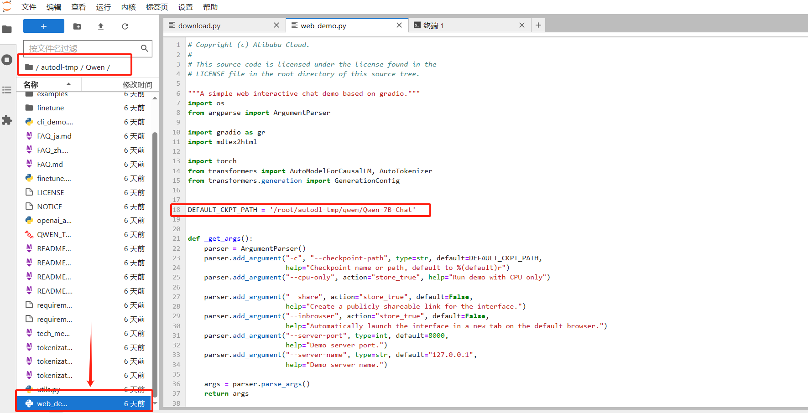

# Qwen-7B-Chat 接入langchain搭建知识库助手
## 环境准备
在autodl平台中租一个3090等24G显存的显卡机器，如下图所示镜像选择PyTorch-->2.0.0-->3.8(ubuntu20.04)-->11.8

接下来打开刚刚租用服务器的JupyterLab，并且打开其中的终端开始环境配置、模型下载和运行demo。

pip换源和安装依赖包
```
# 升级pip
python -m pip install --upgrade pip
# 更换 pypi 源加速库的安装
pip config set global.index-url https://pypi.tuna.tsinghua.edu.cn/simple>

pip install modelscope==1.9.5
pip install "transformers>=4.32.0" accelerate tiktoken einops scipy transformers_stream_generator==0.0.4 peft deepspeed
pip install -U huggingface_hub
```
## 模型下载
使用 modelscope 中的snapshot_download函数下载模型，第一个参数为模型名称，参数cache_dir为模型的下载路径。

在 /root/autodl-tmp 路径下新建 download.py 文件并在其中输入以下内容，粘贴代码后记得保存文件，如下图所示。并运行 python /root/autodl-tmp/download.py执行下载，模型大小为 15 GB，下载模型大概需要 10~20 分钟
```
import torch
from modelscope import snapshot_download, AutoModel, AutoTokenizer
from modelscope import GenerationConfig
model_dir = snapshot_download('qwen/Qwen-7B-Chat', cache_dir='/root/autodl-tmp', revision='master')

import os
# 设置环境变量
os.environ['HF_ENDPOINT'] = 'https://hf-mirror.com'
# 下载模型
os.system('huggingface-cli download --resume-download sentence-transformers/paraphrase-multilingual-MiniLM-L12-v2 --local-dir /autodl-tmp/embedding_model')
```
## 代码准备
首先clone代码，打开autodl平台自带的学术镜像加速。学术镜像加速详细使用请看：https://www.autodl.com/docs/network_turbo/
```
source /etc/network_turbo
```
然后切换路径, clone代码.
```
cd /root/autodl-tmp
git clone https://github.com/QwenLM/Qwen.git
```
切换commit版本，与教程commit版本保持一致，可以让大家更好的复现。
```
cd Qwen
git checkout 981c89b2a95676a4f98e94218c192c095bed5364
```
最后取消镜像加速，因为该加速可能对正常网络造成一定影响，避免对后续下载其他模型造成困扰。
```
unset http_proxy && unset https_proxy
```
修改代码路径，将 /root/autodl-tmp/Qwen/web_demo.py中 13 行的模型更换为本地的/root/autodl-tmp/qwen/Qwen-7B-Chat。

## demo运行
执行下面的命令安装依赖包：
```
cd /root/autodl-tmp/Qwen
pip install -r requirements.txt
pip install -r requirements_web_demo.txt
```
运行以下命令即可启动推理服务
```
cd /root/autodl-tmp/Qwen
python web_demo.py --server-port 6006
```
将 autodl 的端口映射到本地的 http://localhost:6006 即可看到demo界面。

注意：要在浏览器打开http://localhost:6006页面后，模型才会加载，如下图所示：

